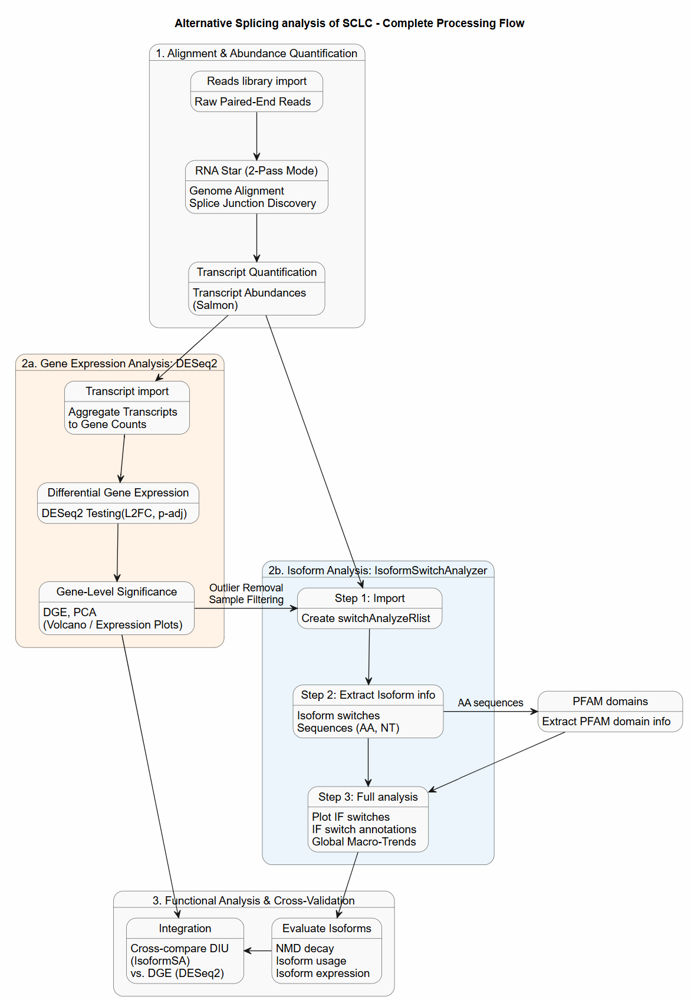

# AS-in-Small-cell-lung-cancer
Analysis of Alternative splicing in Tumor vs. Normal cells for Small cell lung cancer

**Keywords**
Alternative Splicing, Small Cell Lung Cancer, Translational oncology

# Introduction

In this study, I investigated Alternative Splicing in Small Cell Lung Cancer (AS in SCLC). Data I used was taken from the following study [1].  
SCLC is notoriously aggressive form of cancer. Aberrant alternative splicing plays a huge role in cell differentiation and phenotype.
For this analysis, I used RNA STAR in 2-pass mode combined with IsoformSwitchAnalyzeR. IsoformSwitchAnalyzeR focuses on Isoform Switch Identification (ISI), allowing to observe changes in splicing[...]

# Workflow

Complete workflow is provided on Figure 1.

**Figure 1: Complete Processing Workflow**

Workflow steps are described in the following sections

## Reads preprocessing

Initial QC shows negligible adapter content, but for an assay on alternative splicing, requirements for sequence precision are much higher than they would be for a standard gene expression or variant calling.
Because of that, I did not rely on the aligner's soft-clipping, I used fastp for trimming adapter content.

**Initial QC**: [MultiQC raw reads](https://droslj.github.io/AS-in-Small-cell-lung-cancer/MultiQC_pre_trim.html)

**Post trimming QC**: [MultiQC post trimming](https://droslj.github.io/AS-in-Small-cell-lung-cancer/MultiQC_post_trim.html)

## 2-Pass STAR mode for Novel Junctions discovery

RNA STAR supports 2-pass mode for improved junction discovery. In the first pass, STAR aligns the reads and discovers splice junctions de novo. In the second pass, it uses those discovered junctions for more accurate splice junction detection.

## Transcript abundance 

Salmon was used to obtain transcript abundances per sample.

## DESeq2 analysis

DESeq2 analysis was performed using transcript quantifications from Salmon. PCA plot, shown on Figure 2, exposed two major, distinct quality control issues that needed to be resolved before trusting any downstream differential expression statistics from DESeq2:
 Issue #1:  Severe Outlier (SRR38500642) 
 Sample SRR38500642 (Treated) is pulled completely away from everything else along the Y-axis (PC2 explains 23% of the variance).
 Issue #2: A Likely Sample Swap / Mix-up (SRR38500645)
 Sample SRR38500645 is labeled as Normal, but it groups far closer to the Treated samples (SRR38500641 and SRR38500643) than it does to other normal samples.

**Figure 2: PCA plot (DESeq2 run1)**

Closer look on provided data revealed following:
 - Issue 1. The Outlier sample (SRR38500642) has a Sequencing Depth Issue with roughly 30% less sequencing data than its counterparts. 
 - Issue 2. The Misclustered Control (SRR38500645) is due to Unmatched Biological Conditions

According to the abstract, the authors performed multi-omics profiling on treatment-naïve human SCLC tumors along with paired adjacent tissues (NAT, n=12)—which they modeled here in mice (Mus musculus).
- Cancer samples: C4-1, C3-1 and C1-1
- Adjacent tissue: T2-2, T2-1, and T1-1.

I proceeded by droping the low-depth outlier sample SRR38500642 from the count matrix entirely to stabilize the variance and repeated the DESeq2 analysis. 

On second run, the PCA plot (Figure 3) again revealed irregularities.

**Figure 3: PCA plot (DESeq2 run2)**

SRR38500645 (Tumor / C3-1) sample is not clustering on the far right with other tumor replicates (SRR38500644 and SRR38500646), it is pulled heavily to the left along PC1, sitting much closer to the healthy NormalX samples.
In oncology datasets, this intermediate positioning typically points to one of two biological or technical realities:
 1. High Normal Tissue Contamination (Low Tumor Purity)
 2. A Partial Sample Mix-up or Subtype Difference

By keeping this sample, software in subsequent steps would assume that tumors are naturally highly variable, which will blow out the dispersion estimates and dramatically shrink your final list of statistically significant differentially expressed genes (DEGs), so I eliminated this sample from further analysis and continued to Isoform analysis with only four samples.

Repeated DESeq2 analysis revealed that samples are now matched (Figure 4) and it was OK to proceed to next step.

**Figure 4: PCA plot (DESeq2 run3)**

## Analysis of Isoform switcing (IsoformSwitchAnalyzeR)

1.	Part 1 (isoformSwitchAnalysisPart1()): Imports the abundance matrix, runs the differential mapping statistics, identifies switches, and extracts the FASTA sequences of the switching transcripts[...]
2.	External Webservers/Tools: You feed those sequences to Pfam (for domains) and CPAT/CPC2 (for coding potential).
3.	Part 2 (isoformSwitchAnalysisPart2()): Integrates those results to map the exact exon-skipping events to their downstream proteomic damage and spits out publication-ready visual models of the t[...]
Sources
1.	Selecting differential splicing methods: Practical considerations for short-read RNA sequencing - PMC
2.	Enabling Analysis of Isoform Switches with Functional Consequences and the Underlying Alternative Splicing
3.	IsoformSwitchAnalyzeR
4.	IsoformSwitchAnalyzeR: vignettes/IsoformSwitchAnalyzeR.Rmd - rdrr.io

References:
 [1] PRJNA1464579
