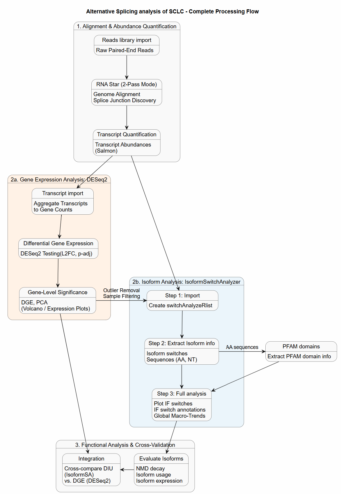

# AS-in-Small-cell-lung-cancer

Analysis of Alternative splicing comparing gene isoforms in Tumor vs. Normal cells for Small cell lung cancer 

**Keywords** 
Alternative Splicing, Isoform switching, Small Cell Lung Cancer, Translational oncology, PFAM domains, Domain switching 

# Introduction

In this study, I investigated Alternative Splicing in Small Cell Lung Cancer (AS in SCLC). Data I used was taken from the following study [1].   
SCLC is notoriously aggressive form of cancer. Aberrant alternative splicing plays a huge role in cell differentiation and phenotype. 

# Analysis method

For this analysis, I used RNA STAR (in 2-pass mode for enhanced splice junction detection) coupled with IsoformSwitchAnalyzeR. IsoformSwitchAnalyzeR focuses on Isoform Switch Identification (ISI), allowing to observe changes in alternative splicing. 

# Workflow

Complete workflow is provided on Figure 1. 

**Figure 1: Complete Processing Workflow**

Workflow steps are described in the following sections 

## Reads preprocessing

Initial QC shows negligible adapter content, but for an assay on alternative splicing, requirements for sequence precision are much higher than they would be for a standard gene expression or variant calling. 
Because of that, I did not rely on the aligner's soft-clipping, I used fastp for trimming adapter content. 

**Initial QC**: [MultiQC raw reads](https://droslj.github.io/AS-in-Small-cell-lung-cancer/MultiQC_pre_trim.html)

**Post trimming QC**: [MultiQC post trimming](https://droslj.github.io/AS-in-Small-cell-lung-cancer/MultiQC_post_trim.html)

 
After clipping, less than 0.5% adapter content is present 

## 2-Pass STAR mode for Novel Junctions discovery

I used RNA STAR 2-pass mode for improved splice junction discovery: 
 - In the first pass, STAR aligns the reads and discovers splice junctions de novo.  
 - In the second pass, it uses those discovered junctions for more accurate splice junction detection. 

## Transcript abundance 

Salmon was used to quantify transcript abundances per sample. Salmon used output from RNA STAR as input (unsorted bam files). 

## DESeq2 analysis

In an Isoform switching assay, performing DESeq2 analysis in paralel offers several benefits. DESeq2 analysis was performed using transcript quantifications from Salmon. PCA plot, shown on Figure 2, exposed two major, distinct quality control issues that needed to be resolved before trusting any downstream differential expression statistics from DESeq2: 

Issue #1:  Severe Outlier (SRR38500642) 
Sample SRR38500642 (Treated) is pulled completely away from everything else along the Y-axis (PC2 explains 23% of the variance). 

Issue #2: A Likely Sample Swap / Mix-up (SRR38500645) 
Sample SRR38500645 is labeled as Normal, but it groups far closer to the Treated samples (SRR38500641 and SRR38500643) than it does to other normal samples. 

**Figure 2: PCA plot (DESeq2 run1)**

Closer look on provided data revealed following: 
 - Issue 1. The Outlier sample (SRR38500642) has a Sequencing Depth Issue with roughly 30% less sequencing data than its counterparts  
 - Issue 2. The Misclustered Control (SRR38500645) is due to Unmatched Biological Conditions. 

According to the abstract, the authors performed multi-omics profiling on treatment-naïve human SCLC tumors along with paired adjacent tissues (NAT, n=12)—which they modeled here in mice (Mus musculus): 
- Cancer samples: C4-1, C3-1 and C1-1 
- Adjacent tissue: T2-2, T2-1, and T1-1. 

I proceeded by droping the low-depth outlier sample SRR38500642 from the count matrix entirely to stabilize the variance and repeated the DESeq2 analysis.  

On second run, the PCA plot (Figure 3) again revealed irregularities. 

**Figure 3: PCA plot (DESeq2 run2)**

SRR38500645 (Tumor / C3-1) sample is not clustering on the far right with other tumor replicates (SRR38500644 and SRR38500646), it is pulled heavily to the left along PC1, sitting much closer to the healthy NormalX samples.
In oncology datasets, this intermediate positioning typically points to one of two biological or technical realities: 
 1. High Normal Tissue Contamination (Low Tumor Purity) 
 2. A Partial Sample Mix-up or Subtype Difference 

By keeping this sample, software in subsequent steps would assume that tumors are naturally highly variable, which will blow out the dispersion estimates and dramatically shrink your final list of statistically significant differentially expressed genes (DEGs), so I eliminated this sample from further analysis and continued to Isoform analysis with only four samples. 

Repeated DESeq2 analysis revealed that samples are now matched (Figure 4) and it was OK to proceed to next step. 

**Figure 4: PCA plot (DESeq2 run3)**

## Analysis of Isoform switcing (IsoformSwitchAnalyzeR)

Analysis of Isoform switching was performed in following steps:
 - Step 1: Import data into R using the appropriate import function to build initial design and transcript structure database 
 - Step 2: Run Part I of the IsoformSwitchAnalyzeR pipeline. This step filters out lowly expressed transcripts, identifies isoform switches, predicts the Open Reading Frames (ORFs), and outputs amino acid sequences 
 - Step 3: Prediction of protein domains with PfamScan using the amino acid FASTA file generated in Step 1 and required files from PFAM scan database 
 - Step 4: PartRun part II of the IsoformSwitchAnalyzeR pipeline - Full Analysis (R). This step integrates results from previous steps to map the exact exon-altering events, and correctly identifies which specific protein domains were gained or lost during isoform switches.   

# Results of Isoform switching

The following sections contain description of some of the more representative gene isoform switching events. 

## Hip1r

Description 
Hip1r is a critical component of clathrin-mediated endocytosis and vesicle trafficking. It physically links the plasma membrane, clathrin coats, and the actin cytoskeleton using different domains. 

**Figure 5: Hip1r Isoforms**

Gene Expression Profile 
Total Hip1r expression exhibits an unchanged / flat trend in the tumor compared to normal tissue. 

Isoforms detected: 
Normal Primary Isoform: ENSMUST00000167879.2 (NMD Insensitive; contains ANTH domain only) — Significantly Decreased in Tumor (p < 0.001) 
Tumor Primary Isoform: ENSMUST00000167325.8 (NMD Sensitive; severely truncated C-terminal transcript) — Increased Usage in Tumor 
Secondary/Minor Isoform: ENSMUST0000000939.15 (NMD Insensitive; full-length canonical transcript with ANTH, HIP1, clathrin-binding, and I_LWEQ domains) — Slight non-significant increase 

Functional Mechanism 
Gain of NMD Sensitivity / Truncation 

Explanation 
The tumor switches from a domain-containing transcript (ENSMUST00000167879.2, ANTH domain) to a truncated, NMD-sensitive non-productive transcript (ENSMUST00000167325.8). This reduces functional endocytic receptor trafficking capacity through non-productive splicing. 

## Coro2b

Description 
Coro2b is an actin-binding protein that regulates cell motility, lamellipodia formation, and cytoskeletal remodeling via autoinhibitory WD40 repeat interactions. 

**Figure 6: Coro2b Isoforms**

Gene Expression Profile 
Total Coro2b expression exhibits an unchanged / minimal change profile in the tumor compared to normal tissue. 

Isoforms detected: 
Normal Primary Isoform: ENSMUST00000048043.12 (NMD Insensitive; full-length harboring DUF1899 and multiple WD40 repeats) — Decreased Usage in Tumor 
Tumor Primary Isoform: ENSMUST00000174439.2 (NMD Insensitive; severely truncated C-terminal fragment containing only partial WD40 domain) — Significantly Increased in Tumor (p < 0.001) 
Minor Isoforms: ENSMUST00000164246.9 and ENSMUST00000173171.3 — Unchanged usage 

Functional Mechanism:  
Loss of N-terminal DUF1899 Domain & WD40 Repeats 

Explanation 
The tumor upregulates ENSMUST00000174439.2, which lacks the DUF1899 domain and most WD40 repeats present in normal tissue (ENSMUST00000048043.12), impairing actin filament binding and cytoskeletal organization. 

## Txlng

Description 
Txlng (Taxilin Gamma) is involved in intracellular vesicle trafficking, syntaxin binding, and nucleocytoplasmic transport pathways. 

**Figure 7: Txlng Isoforms**

Isoforms detected: 
Normal Primary Isoform: ENSMUST00000131463.2 (NMD Sensitive; long transcript with Taxilin domain and extended 3' UTR) — Significantly Decreased in Tumor (p < 0.001) 
Tumor Primary Isoform: ENSMUST00000112314.8 (NMD Insensitive; shorter transcript retaining Taxilin domain) — Significantly Increased in Tumor (p < 0.001) 

Functional Mechanism 
Switch from NMD-Sensitive to NMD-Insensitive Isoform.  

Explanation 
Tumor cells drop ENSMUST00000131463.2 (NMD-sensitive) and upregulate ENSMUST00000112314.8 (NMD-insensitive), preventing mRNA degradation and maintaining Taxilin protein production. 

## Ero1a

Description 
Ero1a is an essential endoplasmic reticulum (ER) oxidoreductase that catalyzes disulfide bond formation during protein folding and oxidative stress response. 

**Figure 8: Ero1a Isoforms**

Gene Expression Profile 
Total Ero1a gene expression exhibits an apparent downregulation in tumor tissue. 

Isoforms detected: 
Normal Primary Isoforms: ENSMUST00000022378.9 (NMD Insensitive; full-length functional ERO1 oxidoreductase domain) — Decreased Usage in Tumor 
Tumor Primary Isoform: ENSMUST00000227315.2 (NMD Sensitive; truncated N-terminal isoform lacking key ERO1 domain regions) — Significantly Increased in Tumor (p < 0.001) 
Minor Isoform: ENSMUST00000228564.2 (NMD Insensitive, truncated) — Low/Decreased usage 

Functional Mechanism:  
Shunting into NMD-Sensitive Truncated Isoform 

Explanation 
Tumor tissue upregulates ENSMUST00000227315.2 (NMD-sensitive, truncated), suppressing functional ER oxidoreductase levels (ENSMUST00000022378.9). 

 ## Uqcc5 
 
Description 
Uqcc5 is a nuclear-encoded assembly factor required for the proper biogenesis and stabilization of Mitochondrial Complex III (cytochrome $bc_1$ complex). 

 

**Figure 9: Uqcc5**

Gene Expression Profile 
Total Uqcc5 expression exhibits an unchanged (flat) profile in tumor compared to normal tissue. 

Isoforms detected: 
Normal Primary Isoforms: ENSMUST00000064032.10 (Unchanged usage; ~50% IF) and ENSMUST00000203261.3 (Decreased usage; full length with UPF0640 domain) 
Tumor Primary Isoform: ENSMUST00000090205.5 (NMD Insensitive; truncated isoform retaining partial UPF0640 domain) — Significantly Increased in Tumor (p < 0.001) 

Functional Mechanism  
Truncation of UPF0640 Complex III Assembly Domain.  

Explanation 
Tumor upregulates ENSMUST00000090205.5, resulting in partial domain truncation compared to full-length ENSMUST00000203261.3. 

## Rras

Description 
Rras is a small GTPase of the Ras superfamily that regulates cell adhesion, integrin activation, and blood vessel architecture. 

**Figure 10: Rras**

Gene Expression Profile 
Total Rras expression exhibits a completely flat / unchanged trend in the tumor compared to normal tissue. 

Isoforms detected: 
Normal Primary Isoform: ENSMUST00000210895.2 (NMD Insensitive; short, non-domain-annotated isoform) — Significantly Decreased in Tumor (p < 0.001, drops to ~0%) 
Tumor Primary Isoform: ENSMUST0000044111.10 (NMD Insensitive; full-length functional Ras domain-containing transcript) — Significantly Increased in Tumor (p < 0.001, reaches ~100% usage) 

Functional Mechanism:  
Gain of Complete Functional Ras GTPase Domain in Tumor 

Explanation 
Tumor tissue switches near 100% to ENSMUST0000044111.10 (full-length Ras domain), replacing a short non-annotated isoform (ENSMUST00000210895.2), directly promoting active oncogenic Ras signaling. 

## Fxyd

Description 
Fxyd3 (Mat8) is an auxiliary transmembrane subunit that regulates the affinity and turnover kinetics of the Na+/K-ATPase ion pump in epithelial membranes. 

**Figure 11: Fxyd3**

Gene Expression Profile 
Total Fxyd3 expression exhibits a modest / non-significant change in the tumor compared to normal tissue. 

Isoforms detected: 
Normal Primary Isoform: ENSMUST00000165465.8 (NMD Insensitive; truncated short non-coding variant lacking the ATP1G1_PLM_MAT8 domain) — Significantly Decreased in Tumor ($p < 0.001$) 
Tumor Primary Isoform: ENSMUST00000167369.8 (NMD Insensitive; full-length functional transcript with intact ATP1G1_PLM_MAT8 ion-channel regulator domain) — Increased Usage in Tumor 
Minor Tumor Isoform: ENSMUST00000186839.2 (Unannotated C-terminal fragment; slight non-significant increase) 
Unchanged Isoforms: ENSMUST00000165265.8 & ENSMUST00000169424.8 

Functional Mechanism 
Acquisition of Full-Length Ion-Channel Regulatory Domain (ATP1G1_PLM_MAT8) 

Explanation 
Tumor cells shift away from a truncated transcript lacking domain annotation (ENSMUST00000165465.8) to the full-length domain-intact isoform (ENSMUST00000167369.8), facilitating  Na+/K+-ATPase regulation. 

## Hsd17b14

Description 
Hsd17b14 encodes a short-chain dehydrogenase/reductase (SDR) family enzyme responsible for the $NAD(P)-dependent oxidoreduction of steroid hormones and lipid substrates. 

**Figure 12: Hsd17b14**

Gene Expression Profile 
Total Hsd17b14 expression remains unchanged in the tumor compared to normal tissue. 

Isoforms detected: 
Normal Primary Isoform: ENSMUST00000107752.12 (NMD Insensitive; full-length functional transcript containing the complete adh_short_C2 dehydrogenase domain) — Significantly Decreased in Tumor ($p < 0.001$) 
Tumor Primary Isoform: ENSMUST00000211029.2 (NMD Insensitive; short internal fragment lacking the adh_short_C2 domain) — Significantly Increased in Tumor ($p < 0.001$, ~45% usage) 

Functional Mechanism  
Loss of adh_short_C2 Dehydrogenase Domain. 

Explanation 
Tumor cells switch from full-length ENSMUST00000107752.12 to a short internal fragment (ENSMUST00000211029.2), abolishing 17 beta-hydroxysteroid dehydrogenase catalytic activity. 

## Commd9

Description 
Commd9 is a component of the COMMD protein family involved in endosomal protein sorting, copper homeostasis, and negative regulation of NF-kB transcriptional activity. 

**Figure 12: Commd9**

Gene Expression Profile 
Total Commd9 expression exhibits an unchanged trend in the tumor compared to normal tissue. 

Isoforms detected: 
Normal Primary Isoform: ENSMUST00000133576.2 (NMD Insensitive; truncated transcript containing only the COMMD9_HN domain, lacking the COMM_domain) — Significantly Decreased in Tumor (p < 0.001) 
Tumor Primary Isoform: ENSMUST0000028584.8 (NMD Insensitive; full-length transcript containing BOTH COMMD9_HN and the downstream COMM_domain) — Significantly Increased in Tumor (p < 0.001, ~100% usage) 

Functional Mechanism  
Gain of C-Terminal COMM Domain in Tumor 

Explanation 
The tumor-upregulated transcript (ENSMUST0000028584.8) contains both the COMMD9_HN and COMM_domain regions, whereas the normal-dominant isoform (ENSMUST00000133576.2) lacked the COMM_domain. The switch actually restores or enhances functional copper binding and NF-kB/CCC complex interactions. 

# Summary of Isoform analysis

Isoform switching of top 10 genes detected in this assay is summarized in the Table 1: 

**Table 1: Summary of Isoform analysis**

**Conclussion**

Above findings can be summarized in following points: 
 
1.	Independence from Gene Expression 
Standard gene-level RNA-seq analysis based on DGE (DESeq2) would completely miss the critical biology behind most of the genes described above that exhibits unchanged/flat trend in the tumor compared to normal tissue. Only going to the gene isoform level enables detection of significant biological modification. 
 

2.	Multi-Layered Regulation 
The tumor is systematically employing three sophisticated survival strategies: 
 - Optimizing active complexes (Rras/Commd9/Fxyd3) 
 - Manipulating cellular surveillance (Txlng/Ero1a) 
 - Re-engineering structural binding domains (Coro2b/Hip1r). 

**References**
 [1] PRJNA1464579
